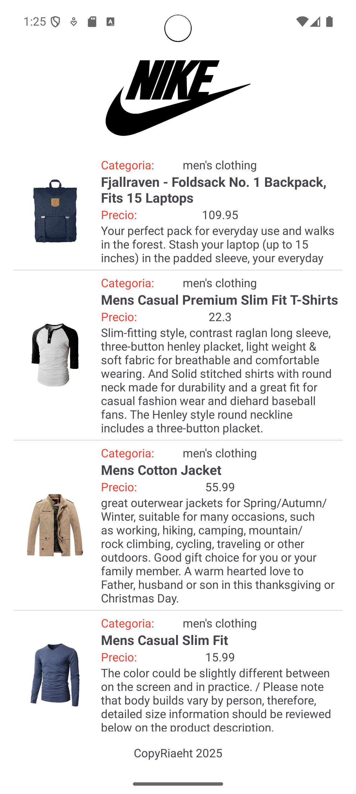

# Listview: App Tienda de Ropa

Se desarrolló una aplicación móvil en Android que consume datos desde un servicio web RESTful y muestra la información en un `ListView`. La fuente de datos utilizada es la API pública:

- **Lista de Productos:** [https://fakestoreapi.com/products](https://fakestoreapi.com/products)

## Funcionalidad Principal

La aplicación obtiene una lista de productos desde la API y presenta cada producto con la siguiente información:

- **Categoría**: Categoría del producto (por ejemplo, `men's clothing`).
- **Nombre del producto**: Título o nombre destacado.
- **Precio**: Precio actual del producto.
- **Descripción**: Breve descripción del producto.
- **Imagen**: Foto representativa descargada desde la URL de la API.

## Componentes Utilizados

- **`ListView`**: Para mostrar la lista de productos en forma de tarjetas o filas, cada una con la información detallada.
- **Adapter personalizado**: Para adaptar los datos JSON al diseño visual del `ListView`.
- **Librería de imágenes** (por ejemplo, Glide o Picasso): Para descargar y mostrar imágenes desde internet.
- **HTTP Client**: Para realizar las peticiones a la API (por ejemplo, Retrofit o HttpURLConnection).
